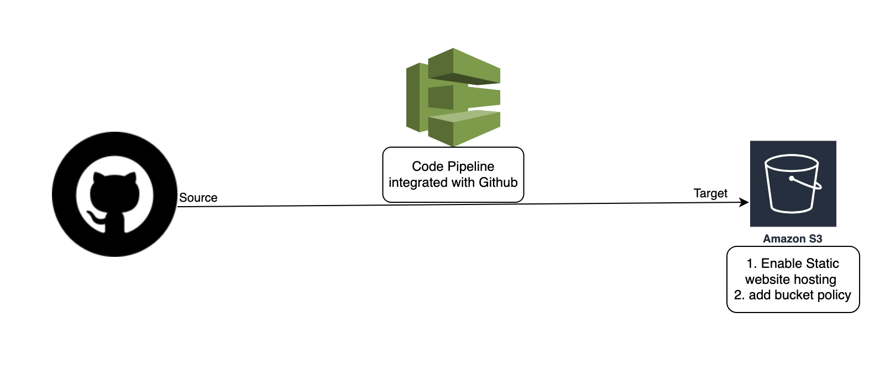

# CICD App Hosting with GitHub, CodePipeline, S3, and SSM Parameter Store

This project sets up a CI/CD pipeline to host a static website using AWS services such as CodePipeline, S3, and SSM Parameter Store. The infrastructure is defined in YAML using AWS CloudFormation and the AWS Serverless Application Model (SAM).

---

## 📑 **Architecture Overview**

The architecture includes:
1. **S3 Bucket**: Hosts the static website.
2. **CodePipeline**: Automates the CI/CD process, integrating with GitHub for source code management.
3. **IAM Role**: Provides permissions for CodePipeline.
4. **SSM Parameter Store**: Stores the GitHub OAuth token securely.

### **Diagram**


---

## ✅ **Prerequisites**

Before you start, ensure the following:

1. **AWS CLI**:
   - Install and configure AWS CLI with appropriate credentials.
     ```bash
     aws configure
     ```
   - Ensure the IAM user has sufficient permissions to deploy the resources.

2. **AWS SAM CLI**:
   - Install SAM CLI for deploying the stack.
     [Installation Guide](https://docs.aws.amazon.com/serverless-application-model/latest/developerguide/install-sam-cli.html)

3. **GitHub Repository**:
   - A GitHub repository containing your static website code (e.g., `index.html` and `error.html`).

4. **GitHub OAuth Token**:
   - Generate a Personal Access Token (PAT) from GitHub with `repo` and `workflow` permissions.
     [Guide to Generate Token](https://docs.github.com/en/github/authenticating-to-github/creating-a-personal-access-token)
   - Store the token securely.

---

## 🚀 **Steps to Deploy**

### **1. Clone the Repository**
```bash
git clone https://github.com/moshi7403/mmr_apps.git
cd mmr_apps
